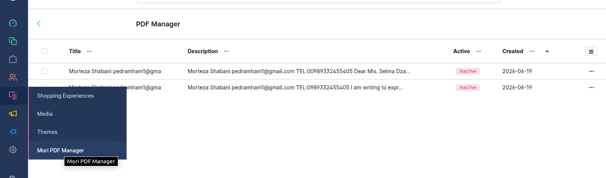

# Shopware 6 PDF Elasticsearch Plugin
## Full-Text Search & PDF Indexing

Convert PDF documents to searchable text and enable fast full-text search using Elasticsearch.

## 🚀 Features

- ✅ **Convert PDFs** to searchable text
- ✅ **Elasticsearch integration** for fast search
- ✅ **Admin panel** for configuration
- ✅ **Reindex command** for bulk updates
- ✅ **Edit** Review and edit title, description etc ...
- 🧩 Search results in Storefront search suggestions

## How It Works

### 1. Upload PDF File
Upload a PDF file to the Shopware media manager.

### 2. Automatic Processing
Click on the PDF file - the plugin automatically:
- Extracts text content from the PDF
- Saves the content to the database
- Indexes the content in Elasticsearch

### 3. Configuration Plugin

### 4. Edit

### 5. Search in Storefront
PDF search results appear in the Storefront search suggestions.

## Requirements

| Requirement | Version         |
|-------------|-----------------|
| Shopware | 6.7.x or higher |
| PHP | 8.2 or higher   |
| Elasticsearch | 7.x     |
| Composer | 2.x             |

## Installation

### 1. Installation

### Navigate to custom plugins directory
> cd custom/plugins/
> git clone https://github.com/pedramham1/mori-elastic-search.git

> php bin/console plugin:refresh

> php bin/console plugin:install --activate MoriElasticSearch

> ./bin/build-administration.sh

> php bin/console cache:clear

> **Note:** 
> - The `./bin/build-administration.sh` command is required for custom plugins
> - Run commands from your Shopware project root directory

## Developer tools
##Tools
####Fixing Issues with ECS
To start using [ECS](https://github.com/easy-coding-standard/easy-coding-standard), just run it, If you're sure, go for a fix command:
<pre>
vendor/bin/ecs check src --fix
</pre>
####Running Unit Tests with PHPUnit
<pre>
./vendor/bin/phpunit --configuration="custom/plugins/WarrantyManager"
</pre>
####Analyzing PHP Code with PHPStan
<pre>
vendor/bin/phpstan analyse src
</pre>

#### Test
<pre>
cd /var/www/html/shopwareProject
</pre>
<pre>
XDEBUG_MODE=coverage vendor/bin/phpunit -c custom/plugins/MoriElasticSearch/phpunit.xml custom/plugins/MoriElasticSearch/tests/ --coverage-html var/log/coverage
</pre>
or
<pre>
vendor/bin/phpunit -c custom/plugins/MoriElasticSearch/phpunit.xml custom/plugins/MoriElasticSearch/tests/
</pre>
