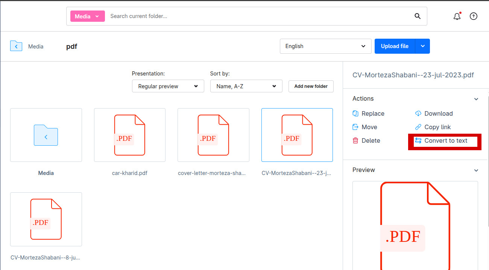
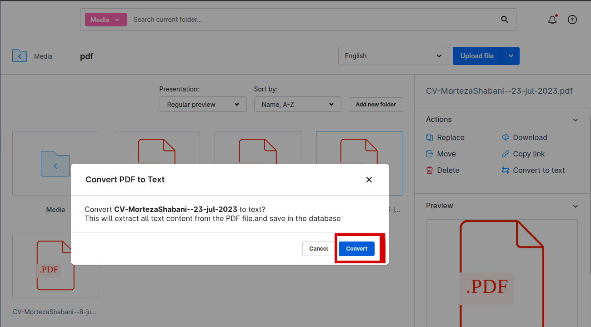
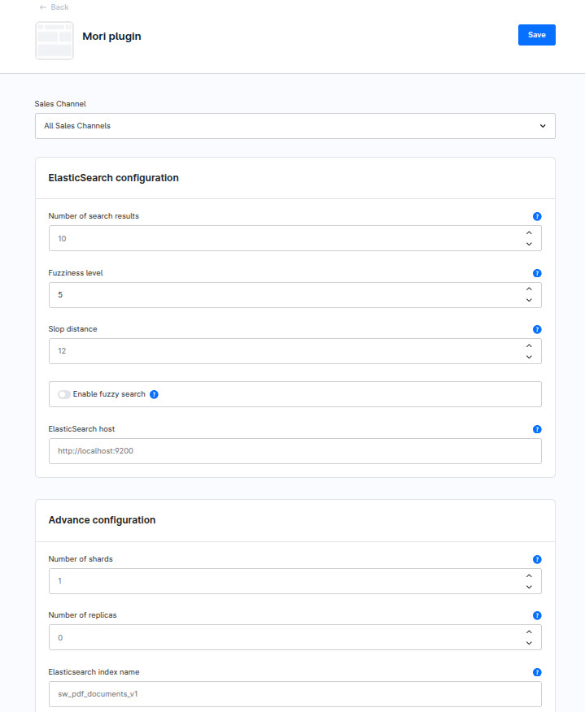
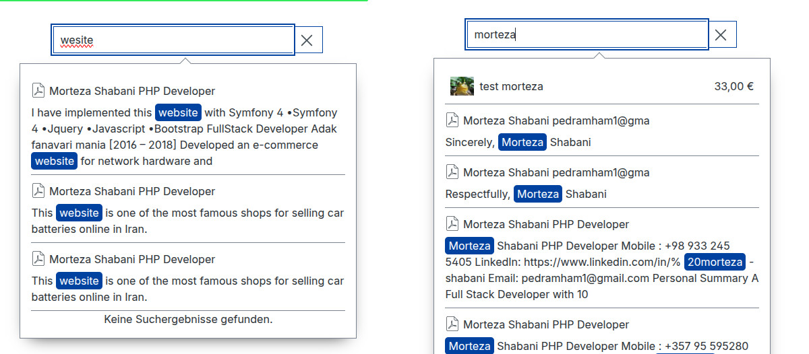

# Mori Elastic Search Plugin for Shopware 6

Convert PDF documents to searchable text and enable fast full-text search using Elasticsearch.
## How It Works

### 1. Upload PDF File
Upload a PDF file to the Shopware media manager.



### 2. Automatic Processing
Click on the PDF file - the plugin automatically:
- Extracts text content from the PDF
- Saves the content to the database
- Indexes the content in Elasticsearch



### 3. Configuration Plugin

### 4. Search in Storefront
PDF search results appear in the Storefront search suggestions.



## Features

- 📄 Extract text from PDF files automatically
- 🔍 Full-text search in PDF content
- ⚡ Elasticsearch integration for fast searches
- 💾 Database fallback when Elasticsearch is unavailable
- 🎯 Smart search strategies (span_near for phrases, fuzzy for typos)
- 🧩 Search results in Storefront search suggestions

## Requirements

| Requirement | Version         |
|-------------|-----------------|
| Shopware | 6.7.x or higher |
| PHP | 8.2 or higher   |
| Elasticsearch | 7.x     |
| Composer | 2.x             |

## Installation

### 1. Installation

```bash
# Navigate to custom plugins directory
cd custom/plugins/

# Clone the repository
git clone https://github.com/yourusername/mori-elastic-search.git

# Go back to project root
cd ../../

php bin/console plugin:refresh
php bin/console plugin:install --activate MoriElasticSearch

# Build the administration
./bin/build-administration.sh

# Clear cache
php bin/console cache:clear

## ⚠️ Important Notes to Add


> **Note:** 
> - The `./bin/build-administration.sh` command is required for custom plugins
> - Run commands from your Shopware project root directory